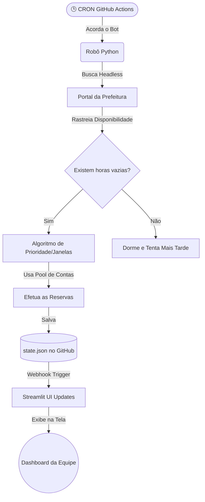

  

<!-- BANNER ANIMADO COM GRADIENTE -->

<!-- TYPING SVG ELEGANTE -->

  

<!-- METADADOS STATUS / FOCO -->

  
  
  

 

<!-- START: INOVATIVE DASHBOARD BUTTON -->
<a href="https://reserva-volei-osvaldo.streamlit.app/">
  <table align="center" style="border-collapse: collapse; border: 2px solid #FF0055; background-color: #0d1117; border-radius: 10px;">
    <tr>
      <td align="center" style="padding: 15px 40px;">
        
         
        
         
        <samp style="color: #C9D1D9; font-size: 13px;">🔗 reserva-volei-osvaldo.streamlit.app</samp>
      </td>
    </tr>
  </table>
</a>
<!-- END: INOVATIVE DASHBOARD BUTTON -->

  

---

## 🏐 O Valor do Produto

Nossa *squad* de vôlei enfrentava um problema crônico de gestão esportiva: **a escalação e reserva de quadras aos sábados**. A dependência de ações manuais resultava em esquecimentos, janelas de horário perdidas e ruído na comunicação.

O **Bot e Hub da Praça Osvaldo** foi desenvolvido para mudar esse cenário, proporcionando:
- **Zero Atrito:** Garantia de disponibilidade da quadra sem acordar cedo ou depender da memória humana.
- **Transparência Compartilhada:** Todos da equipe têm acesso a um *dashboard* com as horas garantidas, o saldo de vitórias semanais do bot e os dias programados.
- **Inteligência Descentralizada:** Um "Plano B" autônomo. Se a quadra ideal já estiver ocupada, o bot executa matrizes de decisão para salvar blocos esportivos menores ou adaptar o cronograma.

---

 

<strong><samp> Engenharia de Automação & Robô Autônomo </samp></strong>

  

<strong><samp> Analytics, UX & Hospedagem </samp></strong>

 

---

## ⚙️ Arquitetura e Nível de Automação

O sistema foi arquitetado para ser uma solução "hands-off" (zero intervenção manual), operando de maneira "invisível" com orquestração completa em nuvem.

### O Fluxo de Execução Silenciosa:

1. **Trigger Baseado em Tempo:** O **GitHub Actions** dispara *jobs* periódicos via sistema de *cron*. 
2. **Scraping e Caça de Horários:** O robô Python usa o **Playwright** em modo *headless* para navegar ao portal de reservas e analisar os próximos 4 sábados disponíveis.
3. **Motor de Decisão (Fallback System):** O bot detém a capacidade de avaliar o terreno. Ele tenta fechar a janela máxima otimizada, porém se o sistema detectar disponibilidade parcial, ele complementa um turno já aberto por outra conta.
4. **Multiplexação de Contas:** Empregando um *pool* dinâmico de contas da equipe (1 hora por conta), ele burla de forma inteligente as restrições logísticas do site.
5. **State GitOps:** Atualiza um repositório central (`state.json`) efetuando *commit* dos resultados adquiridos.
6. **Frontend Reativo:** O webhook do repositório notifica o **Streamlit Cloud**, reiniciando e propagando as vitórias para as interfaces *mobile* da galera em tempo real!

---

 

<!-- FOOTER WAVE MÍSTICO -->

